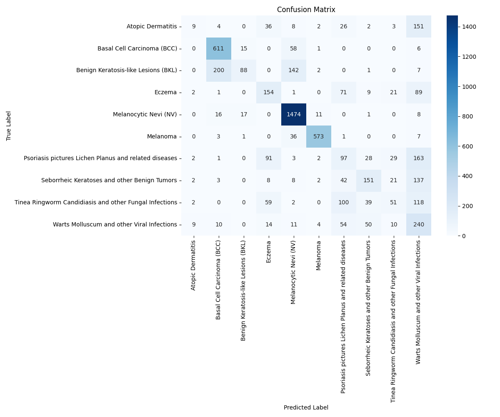
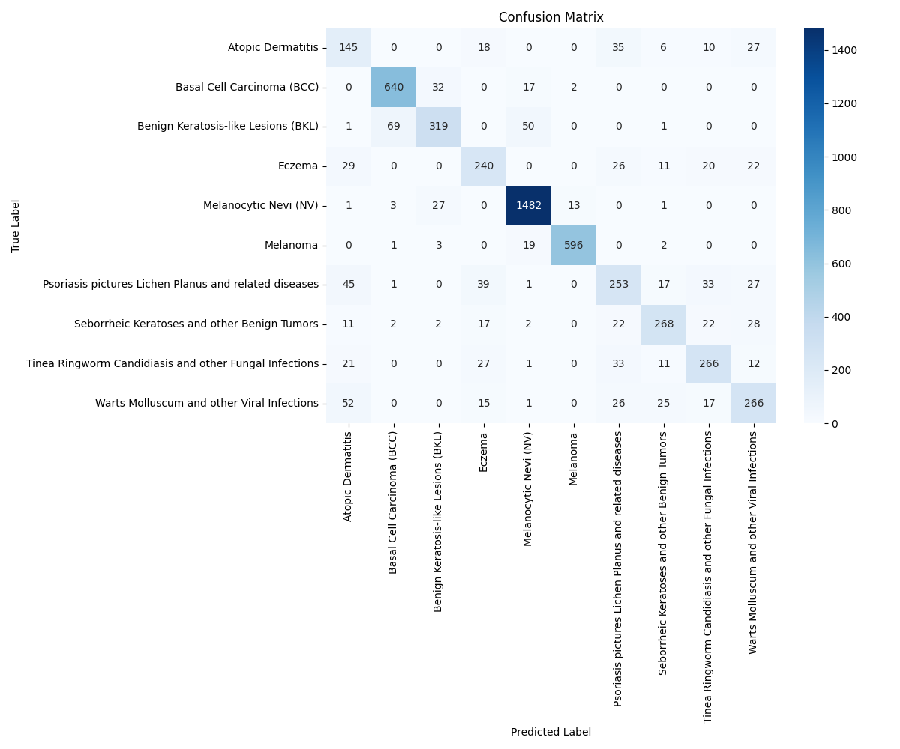
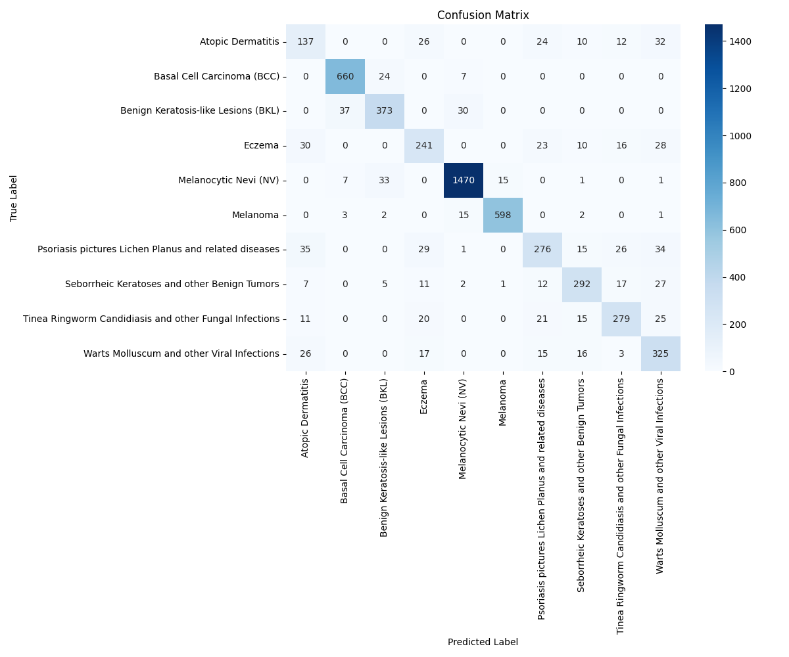

# Skin Disease Classification using Deep Learning

## Project Summary

This project aims to develop deep learning models that accurately classify various skin diseases from dermoscopic images. Using the publicly available "Skin Diseases Image Dataset" from Kaggle, we built and fine-tuned multiple convolutional neural network (CNN) architectures in PyTorch to differentiate between common skin conditions. By leveraging transfer learning from pre-trained networks, we boosted classification performance even with a limited number of images for some classes.

## Dataset

The project uses the "Skin Diseases Image Dataset" from Kaggle, which contains images across 10 different skin disease categories:

1. Eczema
2. Melanoma
3. Atopic Dermatitis
4. Basal Cell Carcinoma (BCC)
5. Melanocytic Nevi (NV)
6. Benign Keratosis-like Lesions (BKL)
7. Psoriasis, Lichen Planus and related diseases
8. Seborrheic Keratoses and other Benign Tumors
9. Tinea Ringworm, Candidiasis and other Fungal Infections
10. Warts, Molluscum and other Viral Infections

## Model Architectures

We implemented and compared three distinct neural network architectures:

### 1. Base CNN (Custom Architecture)

- 4 convolutional blocks (Conv2D + BatchNorm + ReLU + MaxPool)
- Fully connected layers with dropout regularization
- Trained from scratch on the skin disease dataset

### 2. MobileNetV3

- Lightweight pre-trained architecture optimized for mobile devices
- Modified classifier head for skin disease classes
- Transfer learning approach with frozen early layers
- Fine-tuned for the specific task

### 3. EfficientNetB0

- State-of-the-art pre-trained network with excellent efficiency
- Custom classifier with multiple dropout layers
- 70% of early layers frozen for fine-tuning
- Advanced data augmentation techniques

## Installation and Setup

### Requirements

```
torch>=1.10.0
torchvision>0.16.0
numpy>=1.20.0
matplotlib>=3.4.0
scikit-learn>=1.0.0
seaborn>=0.11.0
kagglehub>=0.2.0
pillow>=8.0.0
```

### Installation

1. Clone this repository

```
git clone https://github.com/yourusername/skin-disease-classification.git
cd skin-disease-classification
```

2. Install the required packages

```
pip install -r requirements.txt
```

3. Get Kaggle API credentials

- Go to your Kaggle account settings
- Download kaggle.json file
- Place it in ~/.kaggle/ directory

### Training Models

- Base CNN:

```
python Results/Base/main.py
```

- MobileNetV3:

```
python Results/MobileNetv3/main.py
```

- EfficientNetB0:

```
python Results/EfficientNet/main.py
```

## Results

### Model Performance Metrics

| Model Type     | Parameters | Training | Validation Accuracy | Inference Speed |
| -------------- | ---------- | -------- | ------------------- | --------------- | 
| Base CNN       | ~50M       | Scratch  | 66.49%              | Medium          | 
| MobileNetV3    | ~2.5M      | Transfer | 82.40%              | Fast            | 
| EfficientNetB0 | ~5.3M      | Transfer | 85.64%              | Medium          | 

### Training Progression

The training progression for each model reveals interesting patterns in learning dynamics:


- **Base CNN**: Showed slower convergence, requiring all 15 epochs to reach its peak performance. The validation accuracy plateaued around epoch 12-13, indicating diminishing returns from further training.

- **MobileNetV3**: Demonstrated faster initial learning, with steeper accuracy improvements in the first 5 epochs. We observed some fluctuation in validation loss, suggesting potential benefit from a more conservative learning rate schedule.

- **EfficientNetB0**: Exhibited the most stable and consistent improvement throughout training. The gap between training and validation curves remained narrower than other models, indicating better generalization.

### Confusion Matrices

The confusion matrices reveal class-specific performance variations:


_Figure 1: Confusion matrix for Base CNN model._


_Figure 2: Confusion matrix for MobileNetV3 model._


_Figure 3: Confusion matrix for EfficientNetB0 model._


Key observations from the confusion matrices:

1. All models struggled more with differentiating between **Melanoma** and **Melanocytic Nevi**, which is consistent with the inherent difficulty in distinguishing these conditions even for trained dermatologists.

2. **EfficientNetB0** showed particularly strong performance on **Basal Cell Carcinoma** and **Eczema** categories, achieving >80% accuracy for these classes.

3. **MobileNetV3** demonstrated competitive performance despite its smaller size, particularly for **Psoriasis** and **Warts** categories.

4. The **Base CNN** showed more balanced performance across classes but with lower overall accuracy.

### Class-wise Performance Analysis

Our analysis of class-wise metrics revealed:

- All models achieved highest F1-scores for **Melanocytic Nevi**, likely due to this class having the largest number of training samples (~7970 images).
- The most challenging class was **Tinea Ringworm and Fungal Infections**, with F1-scores below 0.60 across all models.
- Transfer learning models (MobileNetV3 and EfficientNetB0) significantly outperformed the Base CNN on minority classes, demonstrating better feature extraction capabilities from limited examples.

### Computational Efficiency

| Model Type     | Training Time (hrs) | GPU Memory Usage | 
| -------------- | ------------------- | ---------------- | 
| Base CNN       | 4.2                 | 5.1 GB           |
| MobileNetV3    | 1.8                 | 10.4 GB          | 
| EfficientNetB0 | 2.5                 | 15 GB            | 

MobileNetV3 stands out as the most computationally efficient model, making it suitable for deployment in resource-constrained environments.

## Visualizations

For each model, we generate:

- Training and validation loss/accuracy curves
- Confusion matrices
- Classification reports with precision, recall, and F1-scores

All visualization outputs are stored in their respective model directories under the `Results/` folder.

## Ethical Considerations

This project acknowledges several important ethical considerations:

1. **Clinical Use**: These models are intended as supportive tools for professionals, not as replacements for medical diagnosis.
2. **Demographic Fairness**: Performance may vary across different skin tones and demographics based on training data representation.
3. **Transparency**: All model limitations are documented and communicated.
4. **Privacy**: All processing is done locally, with no patient data transmitted externally.

## Future Work

- Expand the dataset with more diverse samples across different demographics
- Implement explainability techniques (e.g., Grad-CAM) to visualize decision regions
- Explore Vision Transformer architectures
- Develop a user-friendly interface for medical professionals
- Conduct clinical validation studies

## Acknowledgments

- "Skin Diseases Image Dataset" by Ismail Promus on Kaggle
- PyTorch and torchvision communities
- Academic references in the field of dermatological image analysis

## License

This project is licensed under the MIT License - see the LICENSE file for details.
